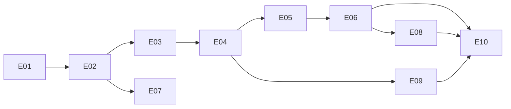

# ÉPICOS — Dream RI

10 épicos alinhados ao cronograma de 6 semanas do PRD §10 / SPEC §13.

---

## E01 — Fundação, domínio e acesso do operador · Semana 1

**Entregável verificável:** operador entra com senha + TOTP; domínio modelado e testado a 100%.

| Item | Req | Story |
|---|---|---|
| Estrutura do monorepo, CI, migrations base | — | — |
| Agregados, VOs e políticas puros | — | — |
| Provisionamento + ativação de TOTP | R0.5 | US-001 |
| Login com 2º fator e sessão em dois estados | R0 | US-002 |
| Códigos de recuperação | R0.5 | US-003 |
| Desativação de operador (revoga sessões) | R0.5 | US-018 |

**Risco:** nenhum externo. É o épico mais previsível — e por isso o que deve absorver o
aprendizado de ferramental.

---

## E02 — Campanha publicável e conta de recebimento · Semana 1

**Entregável:** campanha publicável, com conta verificada.

| Item | Req | Story |
|---|---|---|
| CRUD de campanha com guardas | R1 | US-006 |
| Conta de recebimento + verificação de titularidade | R10 | US-004, US-005 |
| Portão de publicação | R1, R8, R10 | US-007 |
| Fila de estornos pendentes | R10 | US-015 |

**Dependência externa:** conta PicPay aprovada (marco D+7).

---

## E03 — Estoque de 1M e alocação atômica · Semanas 1–2

**Entregável:** 1M de números gerados; alocação sem colisão sob 500 req/s.

| Item | Req | Story |
|---|---|---|
| Geração pré-embaralhada (Fisher-Yates + COPY) | R2 | — |
| Alocador com `SKIP LOCKED` | R2 | US-024 |
| **Teste de concorrência escrito antes** | RNF-01 | — |
| Worker de expiração em lote | R3 | US-050 |

> **Protocolo obrigatório (ADR-012):** o teste de concorrência é escrito **antes** do alocador e
> rodado contra uma implementação deliberadamente ingênua, para provar que ele falha. Teste de
> corrida que nunca falhou não prova nada.

---

## E04 — Checkout Pix fim a fim pelo app · Semana 2

**Entregável:** cadastrar → comprar → Pix → números atribuídos, em homologação, **pelo app**.

| Item | Req | Story |
|---|---|---|
| Cadastro do comprador com PII cifrada | R7 | US-022 |
| Checkout + emissão de cobrança | R3 | US-021, US-023 |
| Webhook + **reconsulta ao PSP** | R3 | — |
| Atribuição pós-pagamento | R2, R3 | US-024 |
| Acesso por código de uso único | R7.5 | US-025 |

**Dependência:** conta PicPay. **Risco:** RSK-06 (webhook não assinado) — mitigado por ADR-022.

---

## E05 — Congelamento, commitment e verificador · Semana 3

**Entregável:** commitment carimbado; comprovante com prova; verificador público funcionando.

| Item | Req | Story |
|---|---|---|
| Congelamento T-2h | R4 | US-051 |
| Snapshot NDJSON + derivação Argon2id em pool | R4 | — |
| Árvore Merkle RFC 6962 | R4 | — |
| Carimbo RFC 3161 | R4 | US-052 |
| Comprovante com prova de inclusão | R5 | US-026 |
| Verificador público | R5 | US-027, US-040, US-041 |

**Dependência crítica:** ACT contratada (marco D+7). **Sem plano B** — G-09.
**Protocolo:** vetores do RFC 6962 e RFC 3161, jamais gerados na sessão (ADR-012).

---

## E06 — Apuração automática e entrega · Semana 4

**Entregável:** apuração pela Federal; entrega registrada e confirmada.

| Item | Req | Story |
|---|---|---|
| Cascata primária → secundária → bloqueio | R6 | US-011 |
| `RegraDeApuracao` (VO puro) | R6 | US-042 |
| Entrada manual com dois responsáveis | R6 | US-012 |
| Retificação com causa fechada | R6 | US-016, US-043 |
| Registro e confirmação de entrega | R8.5 | US-014, US-029 |

**Bloqueador de planejamento:** a fonte secundária **não tem nome** (G-15). Uma cascata com um
degrau indefinido é uma cascata de dois degraus. Resolver antes de começar o épico.

---

## E07 — Compliance e guarda-corpos · Semana 4

| Item | Req | Story |
|---|---|---|
| Limite por CPF, maioridade, consentimento | R8 | — |
| Alerta de autorização vencendo | R8 | US-017 |
| Crypto-shredding + teste no CI | RNF-07 | US-031 |
| Worker de retenção (expurgo + anonimização) | RNF-10 | US-053, US-054 |
| Redator de PII no transporte | RNF-06 | — |

**Lacuna:** não há caminho definido para o titular **pedir** exclusão (G-06). Mecanismo sem porta
de entrada não atende o art. 18.

---

## E08 — Painel do operador e relatórios · Semana 4

| Item | Req | Story |
|---|---|---|
| Visão geral | R9.1 | US-008 |
| Pedidos com busca por CPF (índice cego) | R9.2 | US-009 |
| Apurações com tentativas e reprocesso | R9.3 | US-010 |
| Relatórios e exportação | R9.4 | US-013 |

---

## E09 — App: deep link, E2E, build e submissão · Semana 5

| Item | Req |
|---|---|
| Onboarding, navegação, telas de compra | RNF-15 |
| Deep link do link compartilhável | — |
| E2E Maestro em emulador | RNF-15 |
| Build EAS e submissão às duas lojas | RNF-15 |
| Web mobile-first paritária | RNF-16 |

**Risco:** RSK-02 (loja rejeita app de sorteio). **Mitigação já no plano:** a web não depende de
aprovação, e a campanha real não espera a loja.

---

## E10 — Exceções, carga, hardening e go-live · Semana 6

| Item | Req | Story |
|---|---|---|
| Estados de exceção públicos | R9.6 | US-030 |
| Teste de carga k6 | RNF-02 | US-055 |
| Hardening (headers, rate limit, ASVS) | RNF-05, RNF-12 | — |
| Deploy e campanha real | — | — |

**A semana 6 é folga nomeada**, não gordura. Dois donos prováveis: ciclo de resposta a rejeição
de loja, e o imprevisto que todo projeto tem.

---

## Dependências

## Os nove que nunca se cortam

R0 (E01), R10 (E02), R2 (E03), R4 (E05), R6 (E06), R8 (E07), R8.5 (E06), R9.3 (E08), R9.6 (E10).
**Todos os dez épicos carregam pelo menos um.** Não há épico descartável — o que se corta são
itens dentro deles, na ordem do PRD §10.
