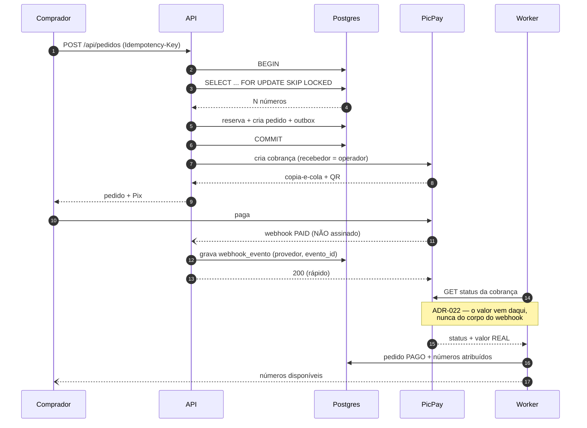
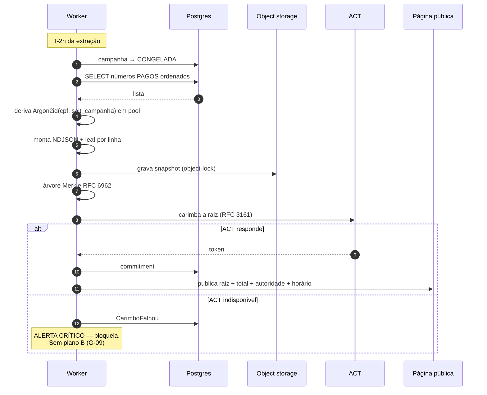
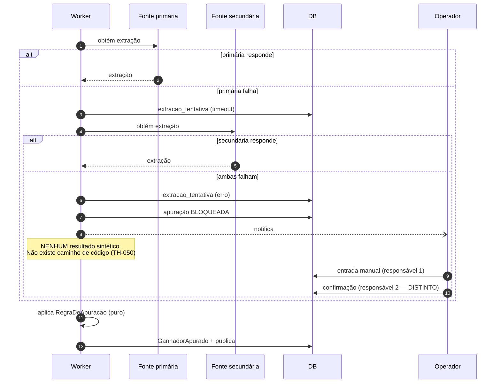
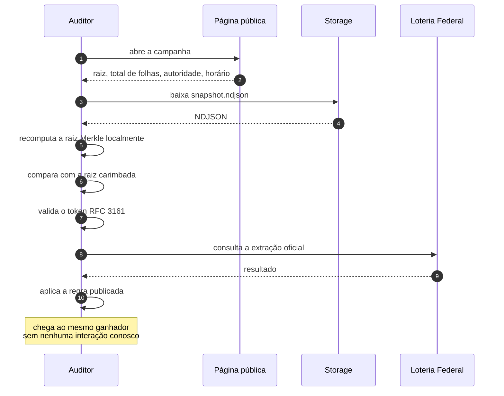
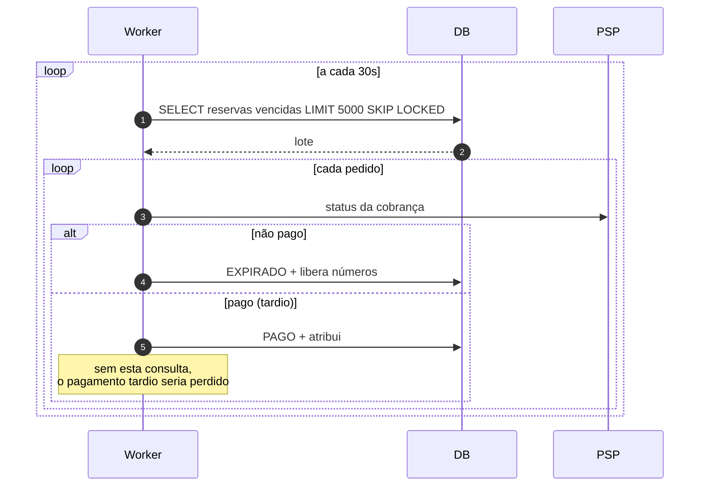

# SEQUÊNCIAS — Dream RI

## 1. Compra: do checkout ao número atribuído

**O passo que carrega o risco:** o webhook chega não assinado. A reconsulta ao PSP é o que impede
que um corpo forjado vire número entregue sem dinheiro (TH-030).

---

## 2. Commitment: a ordem que não pode inverter

**Por que a ordem importa:** carimbar **antes** de a extração existir é o que dá valor probatório.
Inverter qualquer passo destrói a tese.

---

## 3. Apuração: a cascata e o bloqueio

---

## 4. Verificação pelo auditor — sem tocar em nós

**Este é o diagrama que define o produto.** Nenhuma seta aponta para a nossa API. Se alguma
apontasse, a verificação dependeria da nossa colaboração — e deixaria de ser verificação.

---

## 5. Expiração: por que consultar antes

