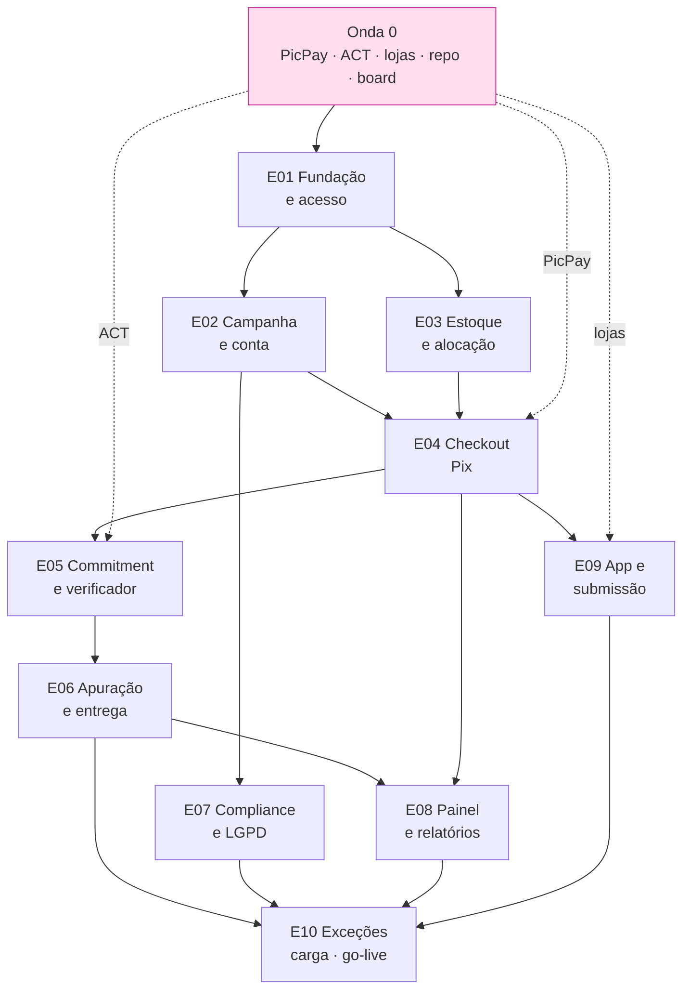

# GRAFO DE DEPENDÊNCIAS — Dream RI



## Caminho crítico

```
Onda 0 → E01 → E03 → E04 → E05 → E06 → E10
```

Sete nós. Qualquer atraso neles empurra o go-live dia a dia.

## Análise de folga

| Épico | No caminho crítico? | Folga |
|---|:-:|---|
| E01 | ✅ | 0 |
| E02 | ❌ | Pode atrasar até E04 precisar |
| E03 | ✅ | 0 |
| E04 | ✅ | 0 |
| E05 | ✅ | 0 |
| E06 | ✅ | 0 |
| E07 | ❌ | Toda a semana 4 |
| E08 | ❌ | Até E10 |
| E09 | ❌ | **Mas a fila da loja é serial** — folga aparente, risco real |
| E10 | ✅ | Absorve a semana 6 |

## As três dependências externas, e o que fazer com cada uma

| Dependência | Bloqueia | Plano B | Ação |
|---|---|---|---|
| **ACT** | E05 → tudo depois | **Nenhum** | Iniciar em D0. É o item de maior alavancagem do projeto |
| **PicPay** | E04 → tudo depois | Nenhum no MVP (ADR-021) | Iniciar em D0 |
| **Lojas** | E09 | Web paritária (RNF-16) | Antecipar E09 logo após E04 |

> **E09 tem folga no grafo e não tem folga na realidade.** A fila de revisão da loja é serial,
> externa e imprevisível. Tratar E09 como "pode esperar" porque o grafo permite é o erro que a
> semana 6 acabaria pagando.

## O nó que não aparece no grafo

**G-15 — a fonte secundária da Federal não tem nome.** Ela é pré-requisito de E06, mas como não
existe ainda, não há nó para desenhar. É a dependência mais fácil de esquecer justamente porque
não está no diagrama.
