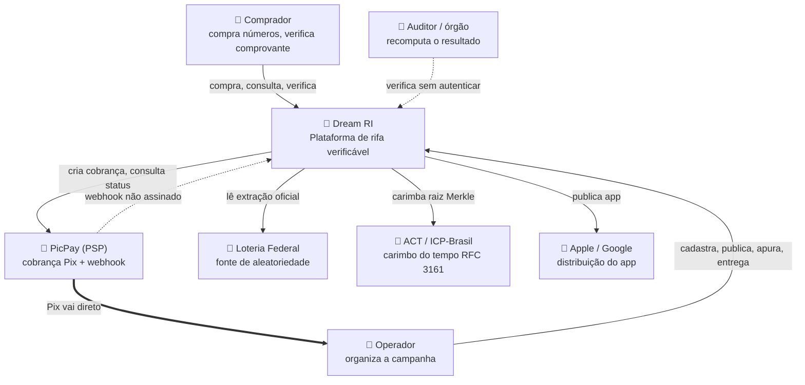

# C4 · Nível 1 — Contexto · Dream RI

## A aresta que define o produto

`psp ==> operador`: **o dinheiro nunca passa pela plataforma** (ADR-17). Isso não é detalhe de
integração — é o que mantém a bit4devs fora do risco regulatório do operador, e o que torna
impossível a plataforma reter valor de terceiro.

## Dependências externas e o que acontece se caírem

| Sistema | Se cair | Mitigação | Plano B |
|---|---|---|---|
| **PicPay** | Sem venda | Porta `GatewayDePagamento` permite trocar o adapter | Nenhum no MVP (ADR-21) |
| **Loteria Federal** | Sem apuração | Cascata primária → secundária → manual assistida | Atraso, nunca invenção |
| **ACT** | Sem prova | Alerta crítico, bloqueia o avanço | **Nenhum** — é o gap mais caro (G-09) |
| **Lojas** | Sem app | Web mobile-first paritária (RNF-16) | A compra continua de pé |

## Fronteira de confiança

| Fronteira | Natureza | Controle |
|---|---|---|
| Comprador → sistema | Não confiável | Zod, rate limit, aceite 18+ |
| **Webhook do PSP → sistema** | **Não confiável e não assinado** | Valor confirmado por consulta à API, nunca pelo corpo (RSK-06) |
| Sistema → Federal | Leitura de fonte pública | Cascata + registro de tentativa |
| Operador → sistema | Autenticado, mas **é a parte auditada** | 2FA, dupla autorização, auditoria append-only |
| Auditor → sistema | Anônimo por design | Só leitura de artefato público |

> A linha "operador é autenticado, mas é a parte auditada" é a mais incomum deste contexto.
> O sistema não confia inteiramente em quem paga por ele — e isso é o produto funcionando.
