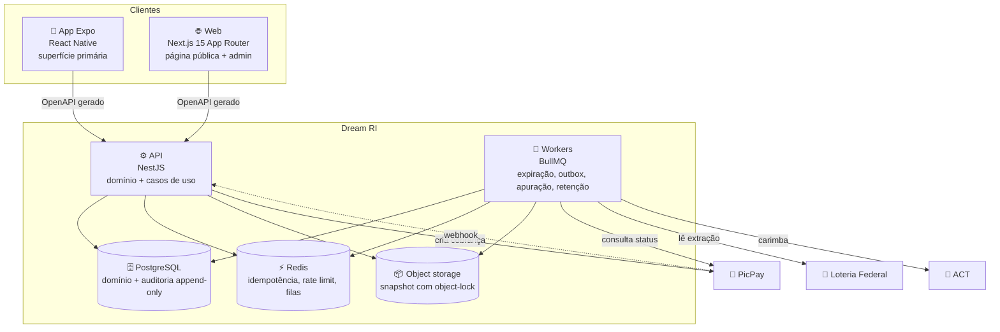

# C4 · Nível 2 — Contêineres · Dream RI

## Contêineres

| Contêiner | Tecnologia | Responsabilidade | Por que separado |
|---|---|---|---|
| **App Expo** | React Native | Superfície primária de compra | Decisão v1.6: o tráfego é mobile |
| **Web** | Next.js 15 | Página pública (SEO/link) + admin + verificador | Página pública precisa de SEO; admin não cabe no app |
| **API** | NestJS | Domínio puro + casos de uso + adapters | — |
| **Workers** | BullMQ | Expiração, outbox, apuração, carimbo, retenção | Trabalho que não pode depender de request; expiração em lote não pode competir com alocação |
| **PostgreSQL** | 16 | Estado + auditoria append-only | `SKIP LOCKED` é requisito — SQLite não reproduz |
| **Redis** | 7 | Idempotência (24h), rate limit, filas | Já necessário para filas; evita mais um componente |
| **Object storage** | S3-compatível | Snapshot com object-lock | Object-lock é o que impede reescrever a lista publicada |

## Decisões de fronteira

**Por que workers separados da API.** O worker de expiração processa lotes de 5.000 linhas e
compete por lock com a alocação. Se rodasse no processo da API, um pico de expiração
(fim de campanha popular) degradaria o checkout — exatamente no pior momento.

**Por que o contrato é OpenAPI gerado dos decorators.** App e web consomem cliente gerado, não
tipos escritos à mão. Fonte única elimina a classe de bug "o front acha que o campo é
opcional e o back acha que não".

**Por que object-lock no snapshot.** O snapshot é o artefato que o auditor baixa. Se pudesse ser
reescrito, o commitment perderia sentido — a raiz carimbada apontaria para um conteúdo mutável.

## O que **não** é contêiner separado, e por quê

| Não separado | Razão |
|---|---|
| Serviço de apuração | Roda como worker; separar traria coordenação distribuída sem ganho |
| BFF | App e web consomem a mesma API; um BFF seria indireção sem propósito no MVP |
| Serviço de verificação pública | É leitura de artefato estático; um endpoint basta |
