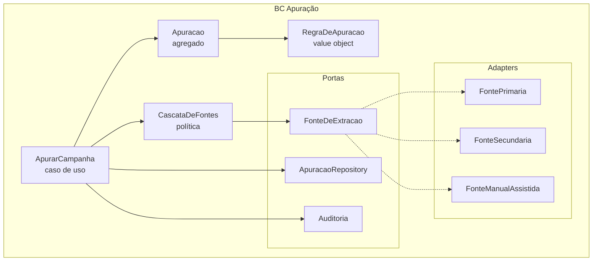

# C4 · Nível 3 — Componentes do BC Apuração

O bounded context mais crítico: é onde a irreversibilidade encontra a falibilidade das fontes.

## Componentes

| Componente | Tipo | Responsabilidade |
|---|---|---|
| `ApurarCampanha` | Caso de uso | Orquestra: obtém extração → aplica regra → publica |
| `Apuracao` | Agregado | Estado da apuração; garante irreversibilidade |
| `RegraDeApuracao` | Value object | Puro: extração + estoque → número apurado |
| `CascataDeFontes` | Política | Primária → secundária → bloqueio |
| `FonteDeExtracao` | Porta | Contrato de obtenção da extração |
| `FontePrimaria` / `FonteSecundaria` | Adapter | Fontes oficiais |
| `FonteManualAssistida` | Adapter | **Bloqueia** e exige dois responsáveis |

## A invariante arquitetural

> **Não existe caminho de código que produza uma extração sintética.**

Isso é garantido por construção, não por convenção:

1. `FonteDeExtracao` só tem três implementações, todas registradas explicitamente.
2. `FonteManualAssistida` **não gera** valor — ela **bloqueia** e aguarda entrada humana.
3. A entrada manual exige dois `operador_id` distintos, verificado no agregado.
4. Toda tentativa vai para `extracao_tentativa`, sucesso ou falha.

Um adapter novo que gerasse número aleatório precisaria ser deliberadamente escrito e registrado —
não há caminho acidental. É a diferença entre "não fazemos isso" e "não é possível fazer isso".

## `RegraDeApuracao` é puro — e por quê importa

Sem I/O, o value object é 100% testável e **recomputável por terceiro**. O auditor aplica a mesma
regra com os mesmos insumos públicos e chega ao mesmo resultado. Se a regra dependesse de estado
interno ou de chamada externa, a verificação independente seria impossível — e a persona P3
deixaria de existir.
