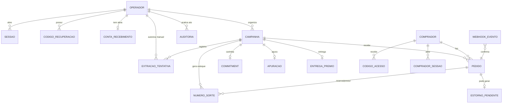

# ERD CONCEITUAL — Dream RI

## Entidades e o que cada uma protege

| Entidade | Guarda | Requisito |
|---|---|---|
| `OPERADOR` | Acesso; **nunca apagado**, só anonimizado (ADR-23) | R0, R0.5 |
| `SESSAO` | Autorização com 2º fator; IP expurgado em D+90 | R0, RNF-10 |
| `CONTA_RECEBIMENTO` | Uma ativa por operador; titularidade conferida | R10 |
| `CAMPANHA` | Ciclo de vida e guardas de publicação | R1, R8 |
| `NUMERO_SORTE` | Alocação atômica; `ordem` pré-embaralhada | R2 |
| `COMPRADOR` | **Toda a PII do produto**; cifrada sob DEK do titular | R7, RNF-07 |
| `PEDIDO` | Máquina de estados do dinheiro | R3 |
| `WEBHOOK_EVENTO` | Idempotência por `(provedor, evento_id)` | RNF-08 |
| `ESTORNO_PENDENTE` | Devolução que falhou; impede o sistema de mentir | R10 |
| `COMMITMENT` | A prova; um por campanha | R4 |
| `APURACAO` | Irreversibilidade com caminho de retificação | R6 |
| `EXTRACAO_TENTATIVA` | Histórico de obtenção, sucesso **e** falha | R9.3 |
| `ENTREGA_PREMIO` | Fecha o loop; sobrevive ao shredding | R8.5 |
| `AUDITORIA` | Append-only encadeada por hash | transversal |

## As três relações que carregam a arquitetura

**`OPERADOR ||--o{ AUDITORIA`** — é por causa desta FK que o operador não pode ser apagado.
Um `DELETE` destruiria a atribuição de quem autorizou a apuração manual (ADR-16/ADR-23).

**`CAMPANHA ||--o| COMMITMENT`** — um commitment por campanha, criado uma única vez. A
cardinalidade `o|` (zero ou um) é o que impede recarimbar depois de conhecer o resultado.

**`PEDIDO ||--o{ NUMERO_SORTE`** — o número aponta para o pedido, não o contrário. Isso permite
`SKIP LOCKED` no lado do número, que é onde a concorrência acontece.

## Onde a PII vive

Só em `COMPRADOR` (cifrada sob DEK do titular), `OPERADOR` (chave da organização),
`ENTREGA_PREMIO.ganhador_cifrado`, `WEBHOOK_EVENTO.payload` e nos campos `ip`/`user_agent` das
sessões. O inventário completo, com o que sobra após o shredding, está na
[SPEC §9](../../SPEC-TECNICA-plataforma-rifa-mvp.md).
