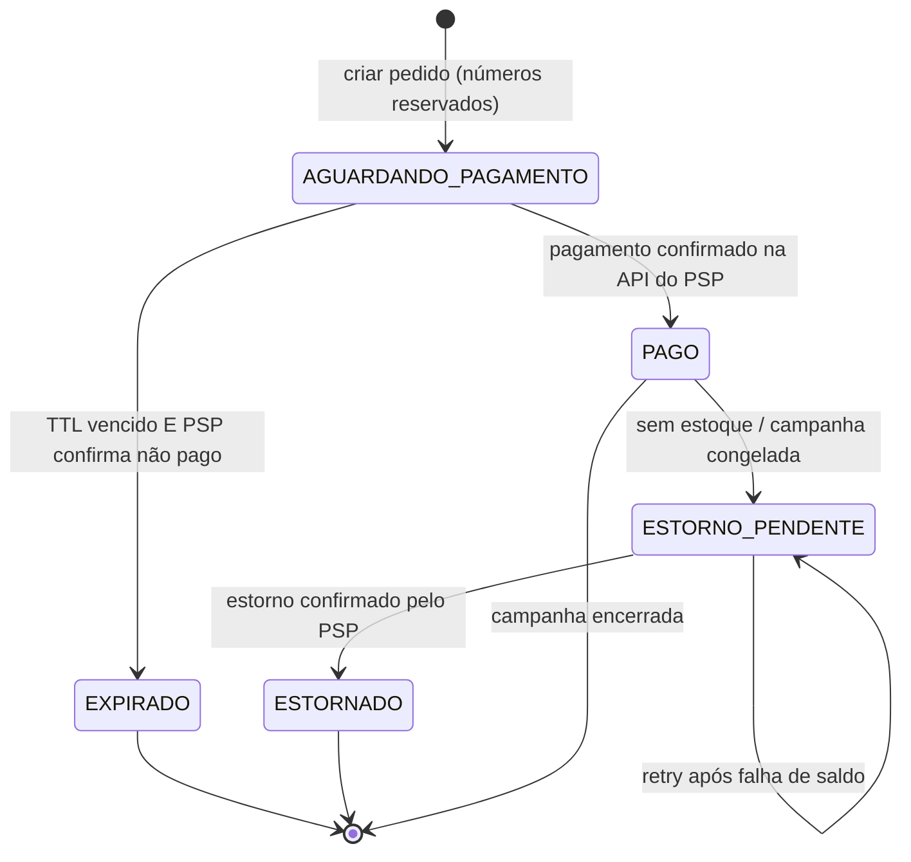
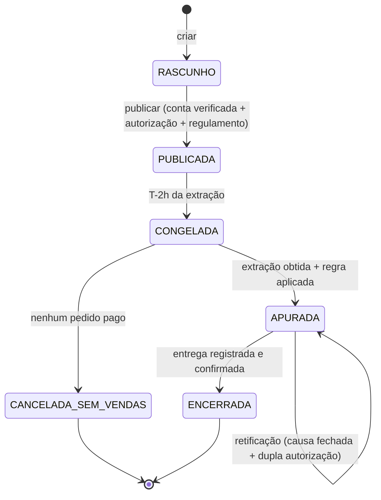
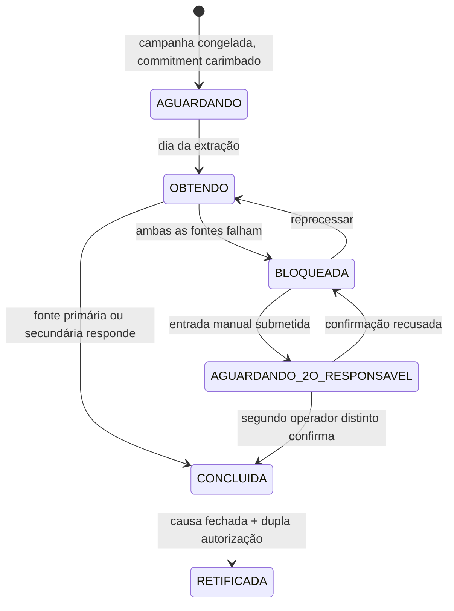
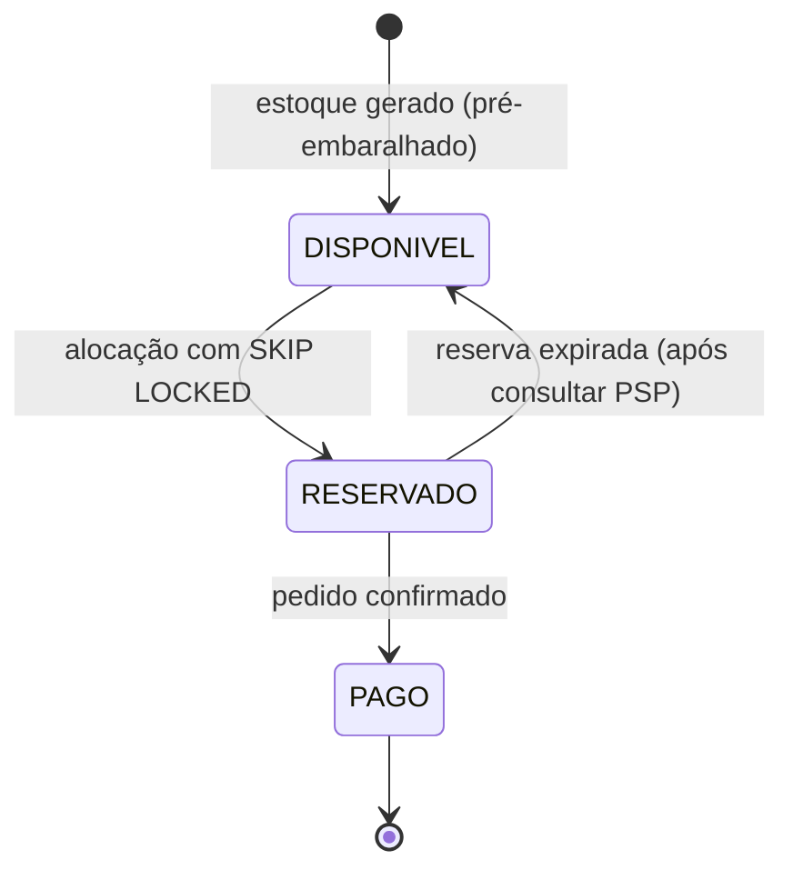
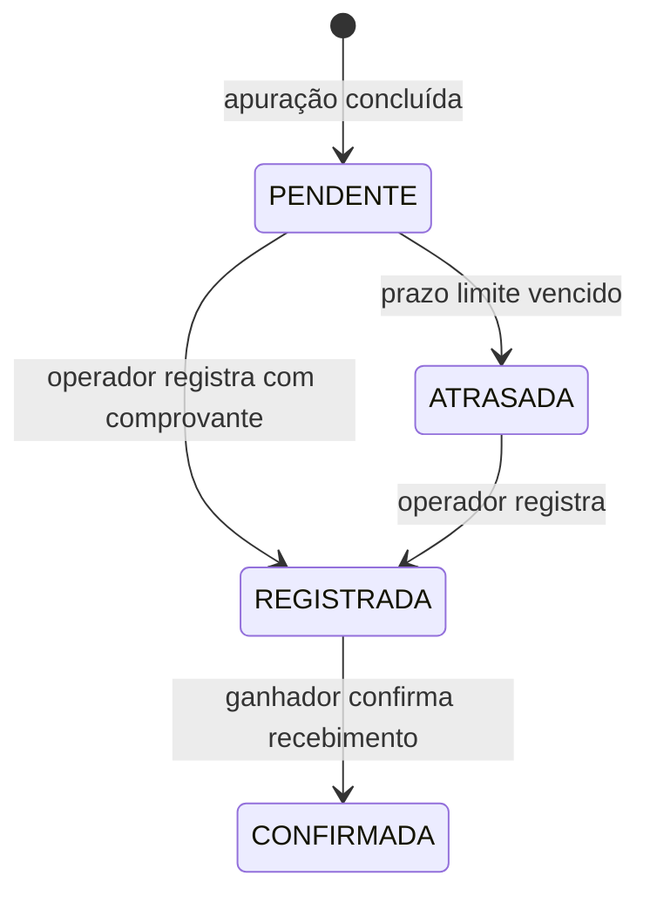

# MÁQUINAS DE ESTADO — Dream RI

## 1. Pedido

### A transição que não existe, e por quê

**`PAGO → ESTORNADO` direto não existe.** O estorno é uma operação no PSP que **pode falhar por
saldo** — a conta é do operador, e ela pode estar vazia. Ir direto de `PAGO` para `ESTORNADO`
declararia devolvido um dinheiro que continua com o operador.

`ESTORNO_PENDENTE` existe para que o sistema **não minta**. O comprador vê "devolução em
andamento", o operador vê a fila com o total devido, e o retry acontece quando o saldo permitir.

### Invariantes

| Invariante | Onde é garantida |
|---|---|
| Números só ficam definitivos em `PAGO` | Agregado `Pedido` |
| `EXPIRADO` exige consulta ao PSP antes | Worker de expiração (BR-046) |
| Pagamento após congelamento nunca chega a `PAGO` | Guarda no agregado (BR-032) |
| Toda transição vai para auditoria | Evento de domínio via outbox |

---

## 2. Campanha

### Por que `APURADA → APURADA`

A retificação **não cria um estado novo**. A apuração original é preservada e continua pública;
a retificada passa a ser a vigente. Modelar a retificação como estado separado sugeriria que o
resultado anterior deixou de existir — e o ponto de ADR-13 é exatamente que ele não deixa.

### Guardas de publicação (o portão)

Publicar é o único ponto onde compliance é verificado. Depois disso a campanha é vendável.

| Guarda | Regra |
|---|---|
| Conta de recebimento verificada | BR-024, BR-144 |
| Autorização com validade futura | BR-025 |
| Regulamento versionado | BR-026 |
| Total de números entre 100 e 1M | BR-020 |

---

## 3. Apuração

**O estado que salva o produto:** `BLOQUEADA`. Sem ele, a única alternativa a "fonte caiu" seria
inventar um resultado. Bloquear é feio, visível e correto — e é por isso que R9.6 dá a ele uma
tela pública.

---

## 4. Número da sorte

**Invariante crítica (BR-043):** dois pedidos concorrentes nunca recebem o mesmo número. A
garantia é `SKIP LOCKED` sobre índice parcial de `DISPONIVEL`, não lock otimista nem retry.

---

## 5. Entrega do prêmio

O estado `CONFIRMADA` sobrevive ao crypto-shredding: `numero_apurado`, datas e status continuam
públicos; a identificação do ganhador fica ilegível (BR-115). É o que concilia LGPD com R8.5.
